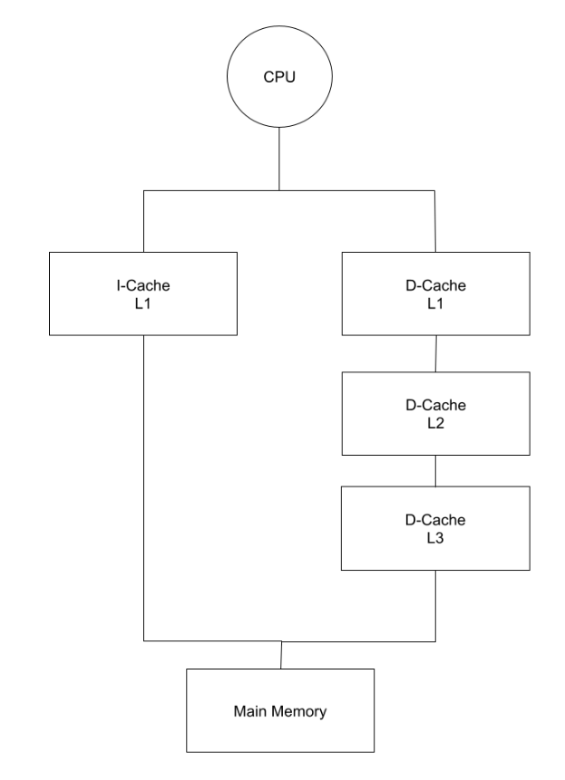

# CS 2200 Spr24 Exam 3

| Question  |           Topic       | Points |
|:---------:|:---------------------:|:------:|
| 1         | Cache EMAT and CPI    | 14     |
| 2         | Paging and Page Size  | 10     |
| 3         | Memory Pressure       | 4      |
| 4         | Cache Miss Types      | 12     |
| 5         | Cache Design          | 10     |
| 6         | Cache Calculations    | 11     |
| 7         | Page Replacement      | 9      |
| **Total** |                       | **70** |

## Question 1 (14 points)
**Cache EMAT and CPI**

Sanskriti's pipelined processor features separate instruction and data caches.
The instruction cache (I-cache) has a **single** level and the data cache
(D-cache) has **three** levels, as shown in the following diagram.

|                 | I-Cache L1 | D-Cache L1 | D-Cache L2 | D-Cache L3 |
|-----------------|------------|------------|------------|------------|
| **Hit Ratio**   | 97%        | 88%        | 75%        | 72%        |
| **Access Time** | 4 cycles   | 4 cycles   | 14 cycles  | 24 cycles  |
| **Block Size**  | 1 word     | 1 word     | 1 word     | 1 word     |

You may assume the following information about this processor and its caches:

* The architecture is word-addressable, and all loads and stores operate on one
  word.
* The processor achieves an average CPI of 1.2, without accounting for memory
  stalls.
* Memory accesses (LWs and SWs) account for 25% of all the instructions
  executed.
* Out of these memory accesses, 65% are reads and 35% are writes.
* On a cache miss, the CPU experiences a latency of 120 cycles to read from
  memory
* There is a latency of 7 cycles to write to memory.
* All caches use the write-through and write-allocate policies.
* There is no write-buffer in the datapath between the CPU and memory bus, hence
  the CPU must stall until each write reaches memory.

For each of the following questions (1.1 to 1.9), show your work to receive
credit. Round your final answers to **2 decimal places**. For EMAT
calculations, give your answer in terms of **CPU cycles**.

### Q1.1 (1 points)
What percentage of all instructions are loads? What percentage of all
instructions are stores?

Loads: 0.65 * 0.25 = 0.1625  
Stores: 0.35 * 0.25 = 0.0875

### Q1.2 (2 points)
Calculate the EMAT for an I-Cache read.

4 + 0.03 * 120 = 7.6  

### Q1.3 (1 point)
Calculate the EMAT for a D-cache L3 read.

24 + 0.28 * 120 = 57.6

### Q1.4 (1 point)
Calculate the EMAT for a D-cache L2 read.

14 + 0.25 *  57.6 = 28.4

### Q1.5 (2 points)
Calculate the EMAT for a D-cache L1 read.

4 + 0.12 * 28.4 = 7.41

### Q1.6 (1 point)
Calculate the EMAT for a D-cache L3 write.

### Q1.7 (1 point)
Calculate the EMAT for a D-cache L2 write.

### Q1.8 (2 points)
Calculate the EMAT for a D-cache L1 write.

### Q1.9 (3 points)
Calculate the effective CPI of the processor, accounting for all the memory
stalls.

## Question 2 (10 points)
**Paging and Page Size**

Consider a byte-addressable memory system with 24-bit virtual addresses, 20-bit
physical memory addresses, and a page size of 2048 B. Calculate the following
for questions 2.1-2.4.

### Q2.1 (2 points)
Size of VPN in bits.

13

### Q2.2 (2 points)
Size of PFN in bits.

9

### Q2.3 (1 point)
Number of page table entries (answer should be in the format: **2ⁿ**).

2^13

### Q2.4 (1 point)
Number of frame table entries (answer should be in the format: **2ⁿ**).

2^9

### Q2.5 (2 points)
A standard page size for virtual memory is 4 KB, but some systems support page
sizes of 2 MB or larger. How does the page size affect the frequency of page
faults in a virtual memory system? Explain your answer.

A larger page size means that we take better advantage of spatial locality,
since more nearby addresses will correspond to the same page. This will help to
reduce page faults from nearby accesses in the same process. However, a larger
page size means less total pages. If we have a lot of processes using a lot of
pages, we will thrash sooner, which results in more page faults.

### Q2.6 (2 points)
How does the page size affect internal fragmentation? Explain your answer.

A larger page size means more internal fragmentation, since there is more total
space so more of it is unused.
## Question 3 (4 points)
**Memory Pressure**

Kaylia notices the following virtual page accesses are recorded for three
independent processes P1, P2, and P3 respectively over a time interval.

P1: 0, 1, 0, 21, 1, 1, 4, 0, 0  
P2: 91, 62, 1, 65, 55, 55, 62, 1, 91, 91, 62  
P3: 45, 10, 3, 3, 5, 7, 28, 5

What is the **cumulative memory pressure** on the system during this time
interval?

P1: {0, 1, 21, 4}  
P2: {91, 62, 1, 65, 55}  
P3: {45, 10, 3, 5, 7, 28}  
**Total**: 4 + 5 + 6 = 15 page frames
## Question 4 (12 points)
**Cache Miss Types**

### Q4.1 (6 points)
Consider a direct-mapped cache with **5 sets**. Sets are indexed from 0 to 4. The
cache block size is a **word**. Assume that the cache is initially empty and that
each memory access operates at word granularity (i.e., all addresses are word
addresses).

a) For the memory accesses shown below starting from an empty cache, fill in
the rows. If there is a miss, please specify the type of miss in the table.
(3 points total)

| Memory Address | Cache Set Accessed | Hit or Miss?     |
|:--------------:|:------------------:|:-----------------|
|      0x01      |         1          | compulsory miss  |
|      0x04      |         4          | compulsory miss  |
|      0x04      |         4          | hit              |
|      0x05      |         0          | compulsory miss  |
|      0x00      |         0          | compulsory miss  |
|      0x04      |         4          | hit              |

b) For the memory accesses shown below starting from an empty cache, fill in
the rows. If there is a miss, please specify the type of miss in the table.
(3 points total)

| Memory Address | Cache Set Accessed | Hit or Miss?     |
|:--------------:|:------------------:|:-----------------|
|      0x03      |         3          | compulsory miss  |
|      0x04      |         4          | compulsory miss  |
|      0x07      |         2          | compulsory miss  |
|      0x03      |         3          | hit              |
|      0x02      |         2          | compulsory miss  |
|      0x04      |         4          | hit              |

### Q4.2 (6 points)
Now, consider a **3-way** set associative cache with 3 sets. The cache uses an
LRU replacement policy. Sets are indexed from 0 to 2 and ways are numbered from
0 to 2. The cache block size is a word. Assume that the cache is initially
empty and that each memory access operates at word granularity (i.e., all
addresses are word addresses). If the cache set is empty, use cache way 0.

c) For the memory accesses shown below starting from an empty cache, fill in
the rows. If there is a miss, please specify the type of miss in the table.
(3 points total)

| Memory Address | Cache Set Accessed | Cache Way Accessed | Hit or Miss?     |
|:--------------:|:------------------:|:------------------:|:-----------------|
|      0x00      |         0          |         0          | compulsory miss  |
|      0x03      |         0          |         1          | compulsory miss  |
|      0x05      |         2          |         0          | compulsory miss  |
|      0x06      |         0          |         2          | compulsory miss  |
|      0x09      |         0          |         0          | compulsory miss  |
|      0x00      |         0          |         1          | conflict miss    |

d) For the memory accesses shown below starting from an empty cache, fill in
the rows. If there is a miss, please specify the type of miss in the table.
(3 points total)

| Memory Address | Cache Set Accessed | Cache Way Accessed | Hit or Miss?     |
|:--------------:|:------------------:|:------------------:|:-----------------|
|      0x04      |         1          |         0          | compulsory miss  |
|      0x07      |         1          |         1          | compulsory miss  |
|      0x05      |         2          |         0          | compulsory miss  |
|      0x07      |         1          |         1          | hit              |
|      0x04      |         1          |         0          | hit              |
|      0x02      |         2          |         1          | compulsory miss  |
## Question 5 (10 points)
**Cache Design**

The CS 2200 TA team is tasked with designing a 4KB (1KB = 1024 bytes) cache.
(Note: Only descriptive answers are expected for this question)

### Q5.1 (3 points)
Nityam decides to design the cache with 256 sets and 16B cache blocks. What are
some drawbacks of his design?

This is a direct mapped cache. A drawback is that each address only corresponds
to one spot in the cache. As a result, it can be an inefficient use of space,
since there’s no flexibility to place addresses in free locations.

### Q5.2 (3 points)
Ayush decides to design the cache with 256 ways and 16B cache blocks. What is
another name for Ayush’s cache design? Why might it not perform as well as
Nityam’s design?

This is a fully associative cache. The downside is that you need a lot of
additional hardware for the comparators.

Note that this does not significantly slow down lookups, since the lookup can
happen in parallel. It will consume more power.

### Q5.3 (4 points)
Kaylia designs a direct mapped cache, but with 256B cache blocks. What are some
of the advantages and disadvantages of this design compared to Nityam’s cache?

An advantage of this cache is that it exploits spatial locality very
effectively, for nearby memory addresses, the hit rate will be extremely high.
However the downside is that on a miss, the penalty is extremely high, since
you need to get a lot of values from memory. There’s also very few sets, so if
the program accesses several values from different parts of memory, we could
see a large slow down.
## Question 6 (11 points)
**Cache Calculations**

Prasad is an intern at Intel. His job is designing a 4-way set-associative
cache with the following characteristics:

* Total cache capacity = 128 KB (1KB = 1024 bytes).
* CPU uses 64-bit byte-addressable memory addresses.
* The cache block size is 64 bytes.
* The cache has one valid bit per cache block.
* The cache uses a write-back policy and uses one dirty bit per 8-byte word to
  minimize the amount of data that must be written back when an eviction
  occurs.
* The cache’s replacement policy guarantees that the two most-recently used
  cache blocks will not be evicted. The MRU fields uniquely identify the two
  most recently used cache blocks in that cache set. For replacement, one of
  the remaining 2 ways is chosen at random.
* MRU does not encode the entire history; it only keeps track of the indices
  of the two most recently accessed ways.

However, Prasad never took CS 2200 and is thus completely lost! Help him by
answering some questions to design the cache.

### Q6.1 (2 points)
How many sets are in the cache?

#sets = Capacity / (associativity * block size) 
128kB / 4 ways / 64 bytes = 512 sets

### Q6.2 (3 points)
How many bits are needed for the following (1 pt each):

a) Block Offset

log_2(64) = 6

b) Index

log_2(512) = 9

c) Tag

64 - 9 - 6 = 49

### Q6.3 (2 points)
How many dirty bits are needed per cache block?

**8**: 1 bit for each 8 byte word

### Q6.4 (2 points)
How many MRU bits are needed per set?

P(4, 2) = 12; at least log_2(12) bits are needed. Since we cannot have a
fractional number of bits, we round up to 4 bits.

### Q6.5 (2 points)
How many bits are required in total for metadata storage (including MRU)? You
don’t need to compute the final sum.

#sets * (MRU + associativity * (valid + dirty + tag)) 
512 * (4 + 4 * (1 + 8 + 49)) = 120832 bits
## Question 7 (9 points)
**Page Replacement**

Consider a paged memory system with **5 physical frames** that the OS has
reserved strictly for housing application pages.

Figure 1 shows a timeline of virtual page accesses with associated timestamps.
For example, at timestamp 2, virtual page 10 is accessed.

**Figure 1: Timeline of Page Accesses**
| Timestamp | Virtual Page Accessed |
|-----------|-----------------------|
| 1         |  1                    |
| 2         | 10                    |
| 3         |  7                    |
| 4         |  3                    |
| 5         |  4                    |
| 6         |  5                    |
| 7         |  1                    |
| 8         |  8                    |
| 9         | 10                    |

The memory system has a hardware component in the CPU called the Tracker. The
Tracker records the access order of all the pages currently in memory. That is,
entry 1 holds the most recently accessed page, entry 2 holds the second most
recently accessed page, and the last entry holds the least recently accessed
page.

Figure 2 shows the contents of the Tracker at timestamp 5. Its contents are
[4, 3, 7, 10, 1]. The first entry in the Tracker is the most recently accessed
page: page 4. The Tracker is accessible to the memory management system in the
OS. There cannot be duplicate entries in the tracker.

**Figure 2: Contents of the Tracker at timestamp 5**
| Entry 1 | Entry 2 | Entry 3 | Entry 4 | Entry 5 |
|---------|---------|---------|---------|---------|
| 4       | 3       | 7       | 10      | 1       |

### Q7.1 (2 points)
Explain how the operating system can use the Tracker component to make page
replacement decisions.

The OS can use the tracker to implement an LRU page eviction policy by choosing
the last entry from the tracker as the victim page.

### Q7.2 (2 points)
What are the contents of the Tracker at timestamp 9?  
| Entry 1 | Entry 2 | Entry 3 | Entry 4 | Entry 5 |
|---------|---------|---------|---------|---------|
| 10      | 8       | 1       | 5       | 4       |

### Q7.3 (3 points)
How many total page faults occur in total in this scenario of 9 page accesses.
Assume that none of the pages are in physical memory in the beginning. Show
your work for credit.

7 compulsory + 2 conflict = 9 total

### Q7.4 (2 points)
Would implementing a Tracker component be feasible for a memory system with
thousands of physical frames? Explain why or why not.

No, since this would require an extremely large hardware stack with thousands
of entries which would have to be updated on every memory access.

